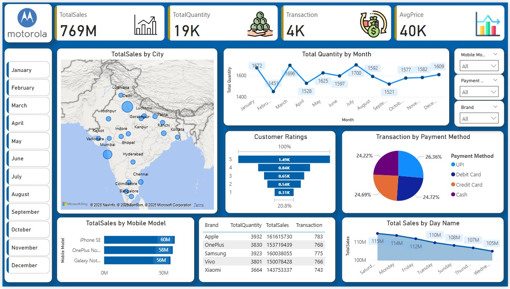

# 📱 Mobile Sales Dashboard – Power BI Project

A comprehensive and visually engaging **Sales Dashboard** developed using **Power BI**, showcasing real-time insights into the performance of multiple mobile phone brands across various cities in India.

This dashboard leverages **DAX calculations**, interactive **slicers**, custom **visualizations**, and **dynamic filters** to provide a deep dive into key sales metrics like revenue, quantity, customer ratings, and transaction behavior.

---

## 🚀 Key Highlights

- 📍 **Geo-visualization of Sales by City**  
  Interactive map highlighting high-performing locations across India.

- 📈 **Total Quantity by Month Trendline**  
  Analyze monthly trends to identify peak seasons and dips in quantity sold.

- 💳 **Transaction Breakdown by Payment Method**  
  Pie chart analysis of UPI, Debit, Credit, and Cash payment preferences.

- 🌟 **Customer Ratings Funnel**  
  Visual representation of how users are rating products (1–5 stars).

- 📅 **Sales by Day of the Week**  
  Discover which weekdays generate the highest revenue.

- 📱 **Sales by Mobile Model**  
  Brand-wise top-selling smartphones (e.g., iPhone SE, OnePlus Nord, Galaxy Note).

- 📊 **Dynamic Filters & Slicers**  
  Instantly filter data based on month, brand, mobile model, or payment type.

---

## 🛠️ Process

### 1. **Data Collection & Cleaning**
- Gathered mobile sales data with fields like brand, model, city, price, rating, quantity, transaction count, and payment method.
- Cleaned the dataset using **Power Query** (removed nulls, duplicates, and fixed types).

### 2. **Data Modeling**
- Built a star schema with dimension and fact tables.
- Added a custom Date Table for time intelligence.
- Created relationships between sales, brands, and time.

### 3. **DAX Measures**
- Created custom measures:
  - `Total Sales`
  - `Total Quantity`
  - `Transaction Count`
  - `Average Price`
  - Star Rating Levels
- Used calculated columns for time-based filtering and visuals.

### 4. **Visualization & Design**
- Used charts like:
  - **Map** for regional sales
  - **Funnel** for customer feedback
  - **Bar, Pie, Line** charts for trend & performance insights
- Included interactive slicers for filtering by time, brand, and model.

### 5. **Optimization**
- Implemented performance-enhancing DAX practices
- Enabled user tooltips, drill-through, and slicer sync
- Ensured responsive layout and fast rendering

---

## 📌 KPIs Tracked

- 🧾 **Total Sales**: ₹769M  
- 📦 **Total Quantity Sold**: 19K+ Units  
- 💼 **Total Transactions**: 4,000  
- 💰 **Average Price per Unit**: ₹40K  
- 🌍 **Top Cities**: Delhi, Bangalore, Mumbai, Lucknow

---

## 🛠️ Tools & Techniques Used

- **Power BI Desktop**
- **DAX (Data Analysis Expressions)**
- **Power Query Editor**
- **Card KPIs, Pie Chart, Line & Bar Charts, Maps**
- **Custom Visuals & Themes**
- **Slicers for advanced filtering**
- **Data Transformation & Modeling**

---

## 💼 Use Case

This dashboard can be used by:

- 🔹 **Retail Managers** to analyze city-wise and model-wise performance  
- 🔹 **Sales Executives** to monitor trends and boost conversions  
- 🔹 **Product Teams** to track customer satisfaction and model popularity  
- 🔹 **Finance & Strategy Teams** for data-driven forecasting and planning

---

## 💡 Insights & Analysis

- **Apple** leads in total sales with ₹161.6M, followed by **Samsung** and **OnePlus**.
- **Saturday** is the top-performing day for sales volume.
- **UPI and Debit Card** payments dominate with over 50% of all transactions.
- High sales observed in **Delhi, Mumbai, Bangalore**, and **Hyderabad**.
- Majority of customer feedback falls in the **4-5 star range**, indicating positive satisfaction.

---

## ✅ Final Outcome

An interactive, visually intuitive dashboard that empowers business stakeholders to:
- Track key performance metrics
- Compare sales by region, product, and payment type
- Identify sales trends and customer preferences
- Make data-driven decisions for mobile retail strategy
---

